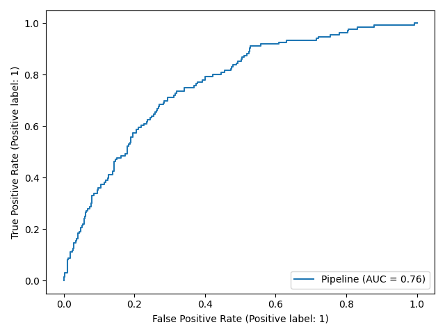

# Team 3 — Customer 360 Intelligence

End-to-end machine learning project for **NileConnect**, a fictional telecom / digital-services company. Using one synthetic customer dataset, the project answers five business questions: who will churn, how much revenue each customer will bring, which natural customer groups exist, how to see the data in fewer dimensions, and which customers behave unusually.

The project is built from the practical workshop template by [mhemaly](https://github.com/mhemaly/ML_Workshop_Customer360). All the work lives in the [`ML_Workshop_Customer360`](ML_Workshop_Customer360) folder.

## Business questions and where they are answered

| # | Question | Technique | Script |
|---|---|---|---|
| 1 | Which customers are likely to churn? | Classification (Logistic Regression, Random Forest) | [`Churn Classification.py`](ML_Workshop_Customer360/src/Churn%20Classification.py) |
| 2 | How much revenue will each customer generate in the next 12 months? | Regression (Linear Regression, Random Forest) | [`Revenue Regression.py`](ML_Workshop_Customer360/src/Revenue%20Regression.py) |
| 3 | What natural customer groups exist? | Clustering (K-Means) | [`Unsupervised Customer.py`](ML_Workshop_Customer360/src/Unsupervised%20Customer.py) |
| 4 | Can behaviour be shown in fewer dimensions? | PCA | [`Dimensionality Reduction (PCA).py`](ML_Workshop_Customer360/src/Dimensionality%20Reduction%20(PCA).py) |
| 5 | Which customers behave unusually? | Isolation Forest | [`Dimensionality Reduction (PCA).py`](ML_Workshop_Customer360/src/Dimensionality%20Reduction%20(PCA).py) |

## Dataset

[`data/customer_360_ml_workshop.csv`](ML_Workshop_Customer360/data/customer_360_ml_workshop.csv): 3,000 synthetic customers, 16 columns.

| Column | Description |
|---|---|
| `CustomerID` | Unique identifier (excluded from modelling) |
| `Age`, `Region` | Customer age and region |
| `TenureMonths` | Months with the company |
| `ContractType` | Month-to-month, one year or two year |
| `InternetType` | Internet technology |
| `MonthlyUsageGB`, `MonthlyChargeEGP`, `NumServices` | Usage, bill and number of services |
| `SupportCalls6M`, `LatePayments12M` | Support calls (6 months) and late payments (12 months) |
| `PaperlessBilling`, `AutoPay` | Billing preferences |
| `SatisfactionScore` | Satisfaction score (1–5) |
| `Churn` | **Classification target** (Yes / No) |
| `Future12MRevenueEGP` | **Regression target** |

The data contains controlled missing values: `InternetType` (45), `MonthlyUsageGB` (75) and `SatisfactionScore` (60). Churn is imbalanced: 18.1% of customers churn.

## Workflow

1. **EDA** ([`eda.py`](ML_Workshop_Customer360/src/eda.py)): shape, data types, missing values, statistics, churn distribution, and churn by contract type and AutoPay.
2. **Preprocessing** ([`preproc.py`](ML_Workshop_Customer360/src/preproc.py)): drops `CustomerID` and both targets (`Future12MRevenueEGP` would leak the outcome), splits 80/20 with `random_state=42` (stratified for churn), then fits only on the training data:
   - numeric columns: median imputation, then standard scaling;
   - categorical columns: most-frequent imputation, then one-hot encoding (`handle_unknown="ignore"`).
3. **Classification**: Logistic Regression and Random Forest baselines with class weighting, then a 5-fold grid search on the Random Forest scored by ROC-AUC, plus a feature-importance ranking.
4. **Regression**: Linear Regression baseline versus Random Forest, evaluated with RMSE and R².
5. **Segmentation**: K-Means with elbow and silhouette analysis (K = 3), plus a profile of each cluster.
6. **PCA and anomalies**: a 2-component PCA projection coloured by churn, and Isolation Forest (5% contamination) shown on the PCA plane.

## Results

Metrics come from running the scripts in this repository on the 600-customer test set (Python 3.12, scikit-learn 1.8). Results can differ slightly on other library versions.

**Churn classification**

| Model | ROC-AUC | Churn recall | Churn precision |
|---|---|---|---|
| Logistic Regression (balanced) | 0.760 | 0.72 | 0.33 |
| Random Forest baseline (balanced) | 0.732 | 0.07 | 0.67 |
| Tuned Random Forest | 0.747 | 0.00 | 0.00 |

Accuracy is about 0.82 for the Random Forest models, but this only reflects the 82% of customers who stay, which is why ROC-AUC and recall are reported. The strongest churn drivers are month-to-month contracts, tenure and satisfaction score.

**Revenue regression**

| Model | RMSE | R² |
|---|---|---|
| Linear Regression | 474.93 | 0.892 |
| Random Forest Regressor | 496.14 | 0.883 |

**Other findings**

- Month-to-month customers churn at 26.6%, against 8.7% (one year) and 5.1% (two year).
- Customers without AutoPay churn at 23.4%, against 14.0% with AutoPay.
- The first two principal components explain 26.7% of the variance.
- Isolation Forest flags 5% of customers (120 of 2,400 in the training set) as unusual.
- K-Means (K = 3) finds one long-tenure group (about 52 months on average) next to two groups of about 19–21 months.

## Repository structure

```text
team-3/
├── README.md
└── ML_Workshop_Customer360/
    ├── main.py                       # runs all analysis scripts in order
    ├── check_environment.py          # prints library versions
    ├── requirements.txt
    ├── data/
    │   └── customer_360_ml_workshop.csv
    ├── src/
    │   ├── commen.py                 # shared imports and data loading
    │   ├── eda.py
    │   ├── preproc.py
    │   ├── Churn Classification.py
    │   ├── Revenue Regression.py
    │   ├── Unsupervised Customer.py
    │   ├── Dimensionality Reduction (PCA).py
    │   └── workshop_tasks.py         # original starter template
    ├── figures/                      # charts (see below)
    ├── outputs/
    │   └── customer_360_predictions.csv
    └── notebooks/
```

## Getting started

**1. Clone the repository**

```bash
git clone https://github.com/Mohamed7787/team-3.git
cd team-3/ML_Workshop_Customer360
```

**2. Install the libraries**

The workshop was designed for Python 3.7 with the pinned versions in `requirements.txt`. Those old versions cannot be installed on recent Python releases. On Python 3.8 or newer, install current versions instead:

```bash
pip install pandas numpy matplotlib scipy scikit-learn
```

For the original setup, use Python 3.7.16 and run `pip install -r requirements.txt`.

**3. Set the data path**

`src/commen.py` and `src/eda.py` currently read the CSV from an absolute Windows path (`C:\Users\PC\Downloads\...`). Change both to point to your copy of the file, for example:

```python
df = pd.read_csv("../data/customer_360_ml_workshop.csv")
```

**4. Run**

```bash
python main.py
```

This runs the EDA, classification, regression, clustering and PCA scripts in order and shows each plot in a window (close a window to continue). You can also run a single script from inside `src`, for example `python eda.py`.

## Included outputs

**Figures** (in [`figures/`](ML_Workshop_Customer360/figures)): [`churn_distribution.png`](ML_Workshop_Customer360/figures/churn_distribution.png), [`classification_roc.png`](ML_Workshop_Customer360/figures/classification_roc.png), [`classification_confusion_matrix.png`](ML_Workshop_Customer360/figures/classification_confusion_matrix.png), [`regression_actual_vs_predicted.png`](ML_Workshop_Customer360/figures/regression_actual_vs_predicted.png) and [`pca_segments.png`](ML_Workshop_Customer360/figures/pca_segments.png).



**Customer 360 table** ([`outputs/customer_360_predictions.csv`](ML_Workshop_Customer360/outputs/customer_360_predictions.csv)): one row per customer (3,000 rows) combining the model outputs.

| Column | Meaning |
|---|---|
| `CustomerID`, `Region`, `ContractType`, `Churn` | Customer identity and actual churn |
| `ChurnProbability` | Predicted probability of churn |
| `Predicted12MRevenueEGP` | Predicted revenue for the next 12 months |
| `Segment` | Customer cluster (0–3) |
| `IsAnomaly` | Flagged as unusual behaviour (90 customers) |
| `RetentionPriority` | `High` (66 customers) or `Normal` |

## Notes and limitations

- **The scripts do not save their outputs.** They only display plots and print metrics. No script in `src/` creates the files in `figures/` or `outputs/`, and the integrated Customer 360 table (the workshop's Part G) has no script here. The included files also come from a different run than the scripts: the table has 4 segments and 90 anomalies, while the scripts use K = 3 and 5% contamination.
- **The tuned Random Forest predicts no churners at the default 0.5 threshold.** The grid search is scored on ROC-AUC and picks no class weighting, which gives high accuracy but zero churn recall. Scoring on recall or F1, or lowering the decision threshold, would be better for a retention use case.
- **Only K-Means is implemented for clustering.** The workshop template also lists Agglomerative Clustering and DBSCAN.
- **Absolute data paths** in `commen.py` and `eda.py` must be edited on every machine (see Getting started).

## Credits

Workshop material and dataset by [mhemaly](https://github.com/mhemaly/ML_Workshop_Customer360). The dataset is synthetic and created for education.
